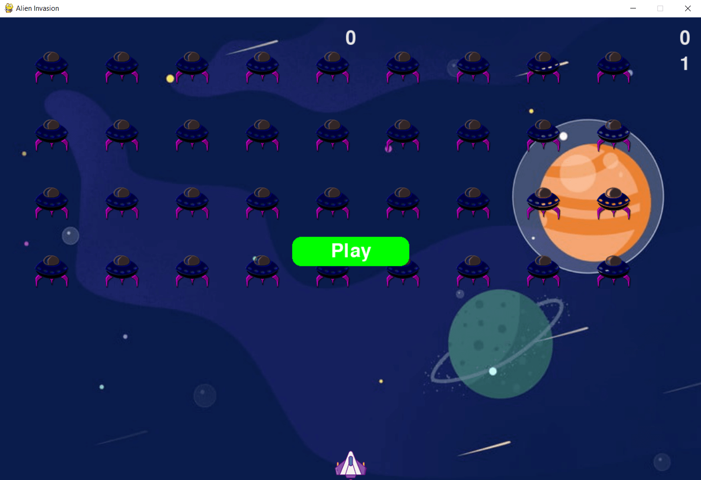

# Alien Invasion



Alien Invasion game build in pygame. The game was addapted and modified from PYTHON CRASH COURSE by ERIC MATTHES.

## Table of Contents

1. [UX](#ux)

    - [Structure](#structure)

    - [Surface](#surface) 

2. [Technologies Used](#technologies-used)

3. [Deployment](#deployment)

    - [Local Clone](#local-clone)

5. [Credit](#credit)

6. [Disclaimer](#disclaimer)

[Back to Top](#table-of-contents)

-----

- ### UX:

  - #### Structure

    - ##### Features: 

      - ##### Existing Features:

        - Multi-level game. After each level speed of the game is increasing

        - A high score is always recorded after each game, so when you play next time you can still see your high score

      - ##### Future Features to Implement:

        - Implement a button to show the instruction for the game

        - Implement a button to mute the sound of the game

        - Implement a button for the high score board for the top five high scores

        - Implement a functionality for pause/unpause the game

        - Implement a button to quit the game

        - Implement the functionality for alien ships to fire after few levels

        - Add life up after some levels

  - #### Surface

    -  ##### Imagery

        - To add some design to the game and make it more personal I have added a background image to game that also reflects the game's purpose right from the start

    -  ##### Sounds

        - Added sound effects to give feedback to players, and to provide an entertaining experience

- ### Technologies Used

  - #### Languages:

    - [Pyhton3](https://www.python.org/) – used to develop the game

  - #### Frameworks, Libraries & Programs:

    - [Pygame](https://www.pygame.org/docs/) - used to create the game

    - [GitHub](https://github.com/) - used to create and host the repository

  - #### Additional tools:

    - [VS Code](https://code.visualstudio.com/) - IDE

 [Back to Top](#table-of-contents)

-----

- ### Deployment

  - #### Local Clone

    #### In order to run this project locally you should have installed these 3 requirements on your machine:

    1. [VS Code](https://code.visualstudio.com/) - IDE or your personal preference

    2. [Pyhton3](https://www.python.org/) - to run the application on your local machine

    3. [PIP](https://pypi.org/project/pip/) for installation of tools needed in this project.
  
    Optional: you can install [Git](https://git-scm.com/).

    #### Steps to follow

    1. At the top of the repository click on Code and click on download zip and extract the zip file to your chosen folder or keep the same name.

    Optional: if you have [Git](https://git-scm.com/) install on your machine you can type

    ```
    git clone https://github.com/constantinadrian/alien_invasion
    ```

    or to clone the repository into a different name on the folder you can run 

    ```
    git clone https://github.com/constantinadrian/alien_invasion folder_name
    ```

    more info about cloning with git [here](https://git-scm.com/book/en/v2/Git-Basics-Getting-a-Git-Repository).


    2. Install pygame library 
    
    Windows installation
    ```
    py -m pip install -U pygame --user
    ```

    Mac installation
    ```
    python3 -m pip install -U pygame --user
    ```
    
    Debian/Ubuntu/Mint
    ```
    sudo apt-get install python3-pygame
    ```

    Fedora/Red hat
    ```
    sudo yum install python3-pygame
    ```

    OpenSUSE
    ```
    sudo zypper install python3-pygame
    ```

    Arch/Manjaro
    ```
    sudo pamac install python-pygame
    ```

    more info about pygame installation [here](https://www.pygame.org/wiki/GettingStarted).

    3. Navigate to the folder where project is 

    4. To run the project run
    ```
    python alien_invasion.py
    ```
     

[Back to Top](#table-of-contents)

-----

- ### Credit

  - #### Code

    - Addapted and modified from PYTHON CRASH COURSE by ERIC MATTHES

    - [Python Docs](https://docs.python.org/3/library/shelve.html)   

    - [Pygame Docs](https://www.pygame.org/docs/)

  - #### Media

    - [Game Background Image](https://pngtree.com/freebackground/universe-planet-background_368589.html)

    - [Spaceship](https://www.flaticon.com/free-icon/spaceship_3098666)

    - [Alien Spaceship](https://www.seekpng.com/ima/u2q8y3a9y3r5o0r5/)

    - [Sounds Effect](https://pixabay.com/sound-effects/search)

- ### Disclaimer

  - This project is for educational purposes only.
